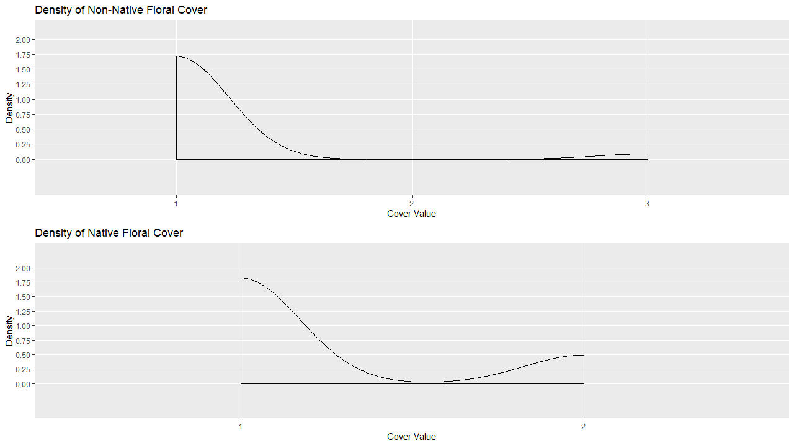
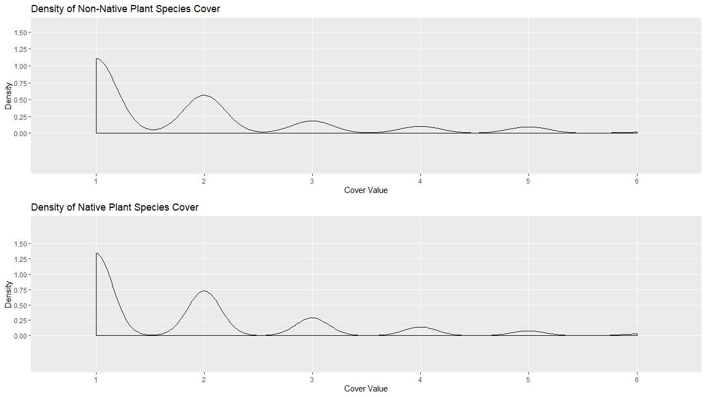
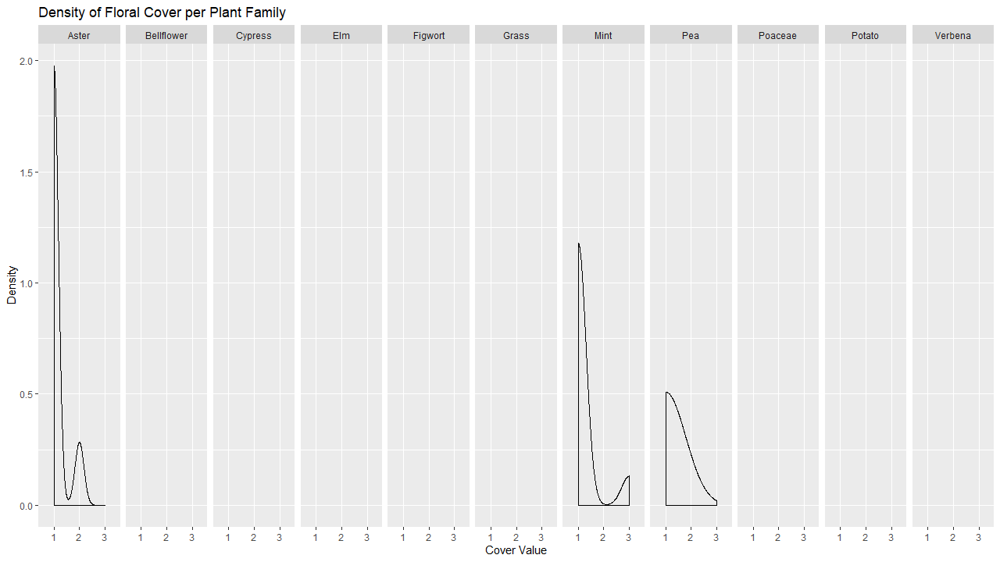
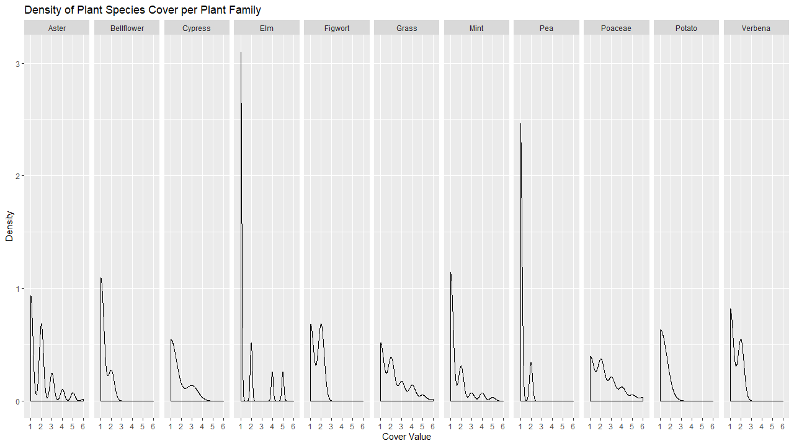

# Libraries
```
library(tidyverse)
library(gridExtra)
```
# CSVs
* FamilyFC.csv  
This contains data of the Floral Coverage Quadrants, Cover Values, and Plant Families.  
* FamilyPSC.csv  
This contains data of the Plant Species Coverage Quadrants, Cover Values, and Plant Families.  
* nativePSC.csv  
This contains data of the Plant Species Coverage Quadrants and Cover Values for native plant species.  
* nonNativePSC.csv  
This contains data of the Plant Species Coverage Quadrants and Cover Values for non-native plant species.  
* nativeFC.csv  
This contains data of the Floral Coverage Quadrants and Cover Values for native plant species.  
* nonNativeFC.csv  
This contains data of the Floral Coverage Quadrants and Cover Values for non-native plant species.
```
FamilyFC <- read_csv("FamilyFC.csv", col_types = cols(X1 = col_skip()))
FamilyPSC <- read_csv("FamilyPSC.csv", col_types = cols(X1 = col_skip()))
nativePSC <- read_csv("nativePSC.csv", col_types = cols(X1 = col_skip()))
nonNativePSC <- read_csv("nonNativePSC.csv", col_types = cols(X1 = col_skip()))
nativeFC <- read_csv("nativeFC.csv", col_types = cols(X1 = col_skip()))
nonNativeFC <- read_csv("nonNativeFC.csv", col_types = cols(X1 = col_skip()))
```
# Plots
Coverage Value is a number assigned to a scale of the percentage of the Quadrant covered by the plant.  
1 -- < 5%   
2 -- 5 - 25%   
3 -- 26 - 50%  
4 -- 51 - 75%  
5 -- 76 - 95%  
6 -- > 99%.  

## Research Question 2: How does the factor of being native versus non-native affect the plant growth of species in the fields tested?
### Multi-Plot of Density per Floral Cover

This plot is a side-by-side look at the Floral Coverage of native vs non-native plant species. It shows the differences in how often they had cover values of 1-3. 4-6 was never hit so the graph was shrunk to 3. Native plants species had a higher density at 1 and 2 but had no values of 3 recorded. The differences at the value of 1 is small but could mean native plants have a higher chance to start up.
```
densityNonNativeFC <- ggplot(nonNativeFC[c(2,9,10)], aes(nonNativeFC$`Cover Value`)) + geom_density() + scale_x_discrete(name ="Cover Value",limits=c("1","2","3","4","5","6"))  + scale_y_discrete(name="Density",limits=c(0.0,0.25,0.5,0.75,1.0,1.25,1.5,1.75,2.0)) + ggtitle("Density of Non-Native Floral Cover")
densityNativeFC <- ggplot(nativeFC[c(2,9,10)], aes(nativeFC$`Cover Value`)) + geom_density() + scale_x_discrete(name ="Cover Value",limits=c("1","2","3","4","5","6"))  + scale_y_discrete(name="Density",limits=c(0.0,0.25,0.5,0.75,1.0,1.25,1.5,1.75,2.0)) + ggtitle("Density of Native Floral Cover")
MultiFC <- grid.arrange(densityNonNativeFC, densityNativeFC)
```
### Multi-Plot of Density for Plant Species Cover

This plot is a side-by-side look at the Plant Species Coverage of native vs non-native plant species. The plant species coverage is a measure of how established the plant is within a quadrant. The higher the value the better the growth. The plots show that the native plants have a higher density in the coverage values 1:4. This is showing that the early establishment of native plants is stronger than non-native plants. Values 5 and 6 show very similar densities between native and non-native plant species but the density is very small for each.
```
densityNativePSC <- ggplot(nativePSC[c(2,9,10)], aes(nativePSC$`Cover Value`)) + geom_density() + scale_x_discrete(name ="Cover Value",limits=c("1","2","3","4","5","6"))  + scale_y_discrete(name="Density",limits=c(0.0,0.25,0.5,0.75,1.0,1.25,1.5)) + ggtitle("Density of Native Plant Species Cover")
densityNonNativePSC <- ggplot(nonNativePSC[c(2,9,10)], aes(nonNativePSC$`Cover Value`)) + geom_density() + scale_x_discrete(name ="Cover Value",limits=c("1","2","3","4","5","6"))  + scale_y_discrete(name="Density",limits=c(0.0,0.25,0.5,0.75,1.0,1.25,1.5)) + ggtitle("Density of Non-Native Plant Species Cover")
MultiPSC <- grid.arrange(densityNativePSC, densityNonNativePSC)
```

## Reasearch Question 3: Do certain plant families show a greater cover value than others plant families?
### Density of Floral Cover by Plant Family

This plot shows that many of the families did not have much data in regards to Floral Coverage. The Aster, Mint, and Pea families were the only ones with recorded data. There is not many conclusions to be drawn from this plot. It is shown that the Aster and Mint family are recorded very highly at the value of 1, which indicates they started growing well, even if only covering a small amount. The Pea family while having less density at the value of 1, has the largest density of 2. The Mint family was the highest at 3, meaning it covered the most amount of the quadrant of any plant family measured by floral coverage.
```
densityFamilyFC <- ggplot(FamilyFC, aes(FamilyFC$`Cover Value`)) + geom_density() + scale_x_discrete(name ="Cover Value",limits=c("1","2","3"))  + scale_y_continuous(name="Density") + facet_grid(~FamilyFC$Family) + ggtitle("Density of Floral Cover per Plant Family"); densityFamilyFC
```
### Density of Plant Species Cover per Plant Family

This plot shows each plant families density of cover data in regards to Plant Species Coverage. Bellflower, Figwort, Pea, Potato, and Verbana show very small, if any density past the Cover Value of 3. This means that the did not grow to cover as much of the quadrant as some of the other families did. Aster, Grass, and Poaceae families showed the highest densities at 6, the top cover value. This means that these families had the highest coverage of their quadrants.
```
densityFamilyPSC <- ggplot(FamilyPSC, aes(FamilyPSC$`Cover Value`)) + geom_density() + scale_x_discrete(name ="Cover Value",limits=c("1","2","3","4","5","6"))  + scale_y_continuous(name="Density") + facet_grid(~FamilyPSC$Family) + ggtitle("Density of Plant Species Cover per Plant Family"); densityFamilyPSC
```
