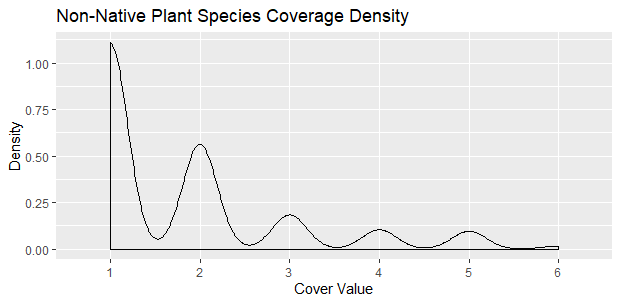
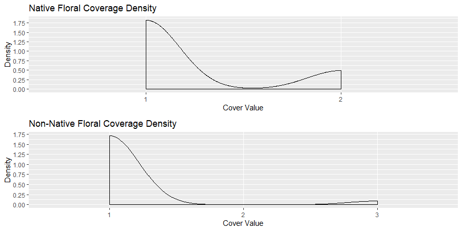

# Individual Plots
### Libraries
```
library(tidyverse)
library(gridExtra)
```
## Non-Native Floral Coverage Density
```
densityNonNativeFC <- ggplot(nonNativeFC[c(2,9,10)], aes(nonNativeFC$`Cover Value`)) + geom_density() + scale_x_discrete(name ="Cover Value",limits=c("1","2","3","4","5","6"))  + scale_y_continuous(name="Density",breaks=c(0.0,0.25,0.5,0.75,1.0,1.25,1.5,1.75,2.0)) + ggtitle("Non-Native Floral Coverage Density")
```

## Non-Native Plant Species Coverage Density
```
densityNonNativePSC <- ggplot(nonNativePSC[c(2,9,10)], aes(nonNativePSC$`Cover Value`)) + geom_density() + scale_x_discrete(name ="Cover Value",limits=c("1","2","3","4","5","6"))  + scale_y_continuous(name="Density",breaks=c(0.0,0.25,0.5,0.75,1.0,1.25,1.5,1.75,2.0)) + ggtitle("Non-Native Plant Species Coverage Density")
```

## Native Floral Coverage Density
```
densityNativeFC <- ggplot(nativeFC[c(2,9,10)], aes(nativeFC$`Cover Value`)) + geom_density() + scale_x_discrete(name ="Cover Value",limits=c("1","2","3","4","5","6"))  + scale_y_continuous(name="Density",breaks=c(0.0,0.25,0.5,0.75,1.0,1.25,1.5,1.75,2.0)) + ggtitle("Native Floral Coverage Density")
```

## Native Plant Species Coverage Density
```
densityNativePSC <- ggplot(nativePSC[c(2,9,10)], aes(nativePSC$`Cover Value`)) + geom_density() + scale_x_discrete(name ="Cover Value",limits=c("1","2","3","4","5","6"))  + scale_y_continuous(name="Density",breaks=c(0.0,0.25,0.5,0.75,1.0,1.25,1.5,1.75,2.0)) + ggtitle("Native Plant Species Coverage Density")
```

# Versus Plots
### Libraries
```
library(gridExtra)
```
## Floral Coverage Density Versus
```
grid.arrange(densityNativeFC,densityNonNativeFC)
```

## Plant Species Coverage Density Versus
```
grid.arrange(densityNativePSC,densityNonNativePSC)
```

