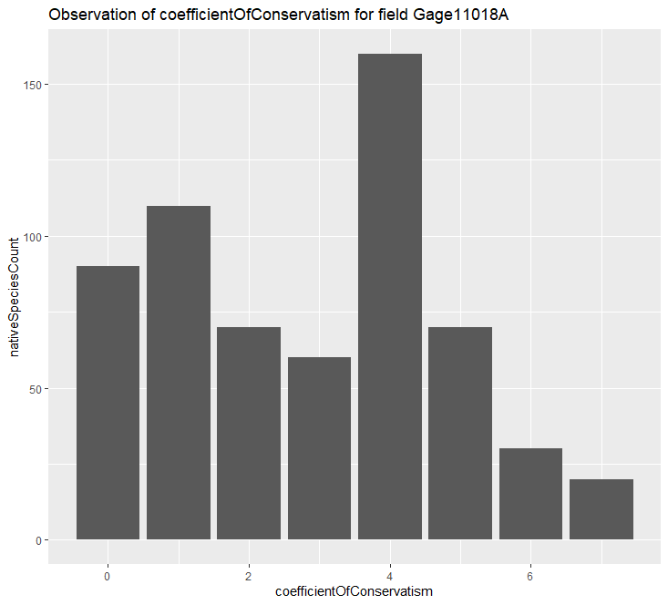

```{r setup, include=FALSE}
knitr::opts_chunk$set(echo = TRUE)
```

# Individual Plots
### Libraries
```
library(tidyverse)
library(gridExtra)
```
## Non-Native Floral Coverage Density
```
densityNonNativeFC <- ggplot(nonNativeFC[c(2,9,10)], aes(nonNativeFC$`Cover Value`)) + geom_density() + scale_x_discrete(name ="Cover Value",limits=c("1","2","3","4","5","6"))  + scale_y_continuous(name="Density",breaks=c(0.0,0.25,0.5,0.75,1.0,1.25,1.5,1.75,2.0)) + ggtitle("Non-Native Floral Coverage Density")
```


This plot shows the density of the floral coverage values for non-native plant species. As the plot shows the highest coverage value recorded was 3. The large majority was 1 meaning very little coverage. This plot can be hard to intepret due to the lack of coverage value range.
## Non-Native Plant Species Coverage Density
```
densityNonNativePSC <- ggplot(nonNativePSC[c(2,9,10)], aes(nonNativePSC$`Cover Value`)) + geom_density() + scale_x_discrete(name ="Cover Value",limits=c("1","2","3","4","5","6"))  + scale_y_continuous(name="Density",breaks=c(0.0,0.25,0.5,0.75,1.0,1.25,1.5,1.75,2.0)) + ggtitle("Non-Native Plant Species Coverage Density")
```


This plot shows the density of the plant species coverage values for non-native plant species. The plot shows an expected decreasing density, with very few at the largest coverage value of 6.
## Native Floral Coverage Density
```
densityNativeFC <- ggplot(nativeFC[c(2,9,10)], aes(nativeFC$`Cover Value`)) + geom_density() + scale_x_discrete(name ="Cover Value",limits=c("1","2","3","4","5","6"))  + scale_y_continuous(name="Density",breaks=c(0.0,0.25,0.5,0.75,1.0,1.25,1.5,1.75,2.0)) + ggtitle("Native Floral Coverage Density")
```


This plot shows the density of the floral coverage values for native plant species. As the plot shows the highest coverage value recorded was 2, which is lower than non-native species. This plot can be hard to intepret due to the lack of coverage value range.
## Native Plant Species Coverage Density
```
densityNativePSC <- ggplot(nativePSC[c(2,9,10)], aes(nativePSC$`Cover Value`)) + geom_density() + scale_x_discrete(name ="Cover Value",limits=c("1","2","3","4","5","6"))  + scale_y_continuous(name="Density",breaks=c(0.0,0.25,0.5,0.75,1.0,1.25,1.5,1.75,2.0)) + ggtitle("Native Plant Species Coverage Density")
```


This plot shows the density of the plant species coverage values for native plant species. The plot shows an expected decreasing density, with very few at the largest coverage value of 6.
# Versus Plots
### Libraries
```
library(gridExtra)
```
## Floral Coverage Density Versus
```
grid.arrange(densityNativeFC,densityNonNativeFC)
```


This versus plot does shows the differences between floral coverage of native and non-native plant species, however since both plots are such a small variation of coverage values it does not show anything very conclusive
## Plant Species Coverage Density Versus
```
grid.arrange(densityNativePSC,densityNonNativePSC)
```


This versus plots shows the differences between plant species coverage of native and non-native plant species. The values of 1, 2, and 3 all show a higher density in the values for native plant species. This means that more native plants were recorded as established than non-native plants.

## Plots showing the conservatism of coefficient specific to the filed_ID Gage11018A


### R Scripts

#### libraries
library(tidyverse)
library(ggplot2)
library(dplyr)


plot <- filter(nativeFC, Field_ID=="Gage11018A")
ggplot(plot, mapping =aes(x=Coefficient_of_Conservatism))+ geom_bar() + labs(x = "ConservatismOfCoefficient", y= "nativeSpeciesCount", title="Observation of conservatism of coefficient for field Gage11018A")



Analysis:
Based on this plot we could say that the maximum number of species count fall under the coefficient of conservatism of 4 where the coefficient value ranges from 0 to 7.

ggplot(plot, mapping =aes(x=Coefficient_of_Conservatism,y=Visit_ID))+ geom_point()+labs(x = "ConservatismOfCoefficient", y= "Visit_ID", title="Observation specific to visitID for field Gage11018A")


Analysis:
Based on this plot we could see that there is a consistent in the coefficient ranging from 1 - 4 compared to other ranges for the native species specific to the vist_ID in the field Gage11018A.

## Plots showing the conservatism of coefficient specific to the filed_ID Webster11004

plot2 <- filter(nativeFC, Field_ID=="Webster11004")
ggplot(plot2, mapping =aes(x=Coefficient_of_Conservatism))+ geom_bar() + labs(x = "ConservatismOfCoefficient", y= "nativeSpeciesCount", title="Observation of conservatism of coefficient for field Webster11004")


Analysis:
Based on this plot we could say that the maximum number of species count fall under the coefficient of conservatism of 4 where the coefficient value ranges from 0 to 7.

ggplot(plot2, mapping =aes(x=Coefficient_of_Conservatism,y=Visit_ID))+ geom_point()+labs(x = "ConservatismOfCoefficient", y= "Visit_ID", title="Observation specific to visitID for field Webster11004")


Analysis:
Based on this plot we could see that there is a consistent in the coefficient in the range 2,4,5 & 6 compared to other ranges for the native species specific to the vist_ID in the field Webster11004.


## Research Question
How does the the factor of being native versus non-native affect the plant growth of species in the fields tested?
### Plots

### Interpretation
This plot shows a side by side look at the density of plant species coverage for native and non-native plants. The plant species coverage is a measure of how established the plant is within a quadrant. The higher the value the better the growth. The plots show that the native plants have a higher density in the coverage values 1:4. This is showing that the early establishment of native plants is stronger than non-native plants. Values 5 and 6 show very similar densities between native and non-native plant species but the density is very small for each.

```
expSpeciesData <- read.csv('Species_Attribute_expanded.csv',head=T)
attach(expSpeciesData)
```

```
expSpeciesDataRem <- expSpeciesData[,-c(2:3)]
nativePlantCover <- read.csv('nativePlantCover.csv',head=T)
```

```
library(tidyverse)
expNativePlantCover <- merge(expSpeciesDataRem,nativePlantCover, by=c('Species'),all.x = F)
```
``` 
expNatPlantCovNA <- na.omit(expNativePlantCover,CoverValue)
condNatPlantCover <- select(expNatPlantCovNA, Order, CoverValue)
condNatPlantCoverMean <- condNatPlantCover %>%
    group_by(Order) %>%
    summarise(mean=mean(CoverValue), n = n())
attach(condNatPlantCoverMean)   
```
 
###  Dot Plot of Mean Data

It shows that of the groupings that survived some cover values where significant to others but mostly they fell in the same rage

```
library(ggplot2)
library(scales)
theme_set(theme_classic())
ggplot(condNatPlantCoverMean, aes(x=mean, y=Order)) + 
  geom_point(col="tomato2", size=3) +   # Draw points
  geom_segment(aes(x=mean, 
                   xend=mean, 
                   y=Order, 
                   yend=Order), 
               linetype="dashed", 
               size=0.1) 
```
Note that the `echo = FALSE` parameter was added to the code chunk to prevent printing of the R code that generated the plot.

## Contributorship Statement

Erik Worked on Non-Native and Native Floral Coverage Density

Kristi wored on the Taxonomy data

Anitha worked on the conservatism of coefficient

Abe created the Rmarkdown 

1, Abdulelah Almubarak, have reviewed and proofread the following work and agree that it is ready for submission.
