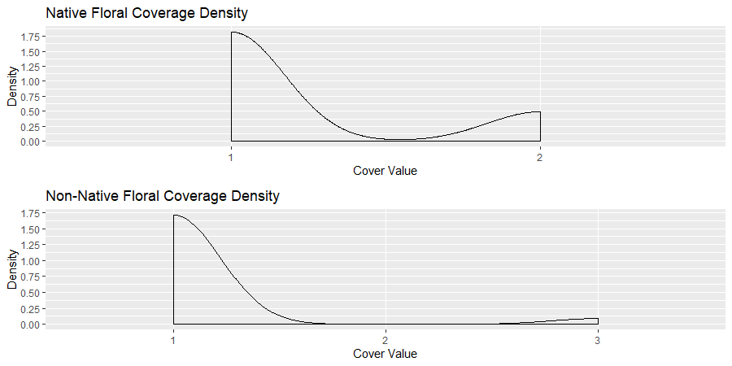

```{r setup, include=FALSE}
knitr::opts_chunk$set(echo = TRUE)
```

# Individual Plots
### Libraries
```
library(tidyverse)
library(gridExtra)
```
## Non-Native Floral Coverage Density
```
densityNonNativeFC <- ggplot(nonNativeFC[c(2,9,10)], aes(nonNativeFC$`Cover Value`)) + geom_density() + scale_x_discrete(name ="Cover Value",limits=c("1","2","3","4","5","6"))  + scale_y_continuous(name="Density",breaks=c(0.0,0.25,0.5,0.75,1.0,1.25,1.5,1.75,2.0)) + ggtitle("Non-Native Floral Coverage Density")
```
### [Non-Native Floral Coverage Density](NonNativeFloralCoverageDensity.png)

This plot shows the density of the floral coverage values for non-native plant species. As the plot shows the highest coverage value recorded was 3. The large majority was 1 meaning very little coverage. This plot can be hard to intepret due to the lack of coverage value range.
## Non-Native Plant Species Coverage Density
```
densityNonNativePSC <- ggplot(nonNativePSC[c(2,9,10)], aes(nonNativePSC$`Cover Value`)) + geom_density() + scale_x_discrete(name ="Cover Value",limits=c("1","2","3","4","5","6"))  + scale_y_continuous(name="Density",breaks=c(0.0,0.25,0.5,0.75,1.0,1.25,1.5,1.75,2.0)) + ggtitle("Non-Native Plant Species Coverage Density")
```
###[Non-Native Plant Species Coverage Density](NonNativePlantSpeciesCoverageDensity.png)

This plot shows the density of the plant species coverage values for non-native plant species. The plot shows an expected decreasing density, with very few at the largest coverage value of 6.
## Native Floral Coverage Density
```
densityNativeFC <- ggplot(nativeFC[c(2,9,10)], aes(nativeFC$`Cover Value`)) + geom_density() + scale_x_discrete(name ="Cover Value",limits=c("1","2","3","4","5","6"))  + scale_y_continuous(name="Density",breaks=c(0.0,0.25,0.5,0.75,1.0,1.25,1.5,1.75,2.0)) + ggtitle("Native Floral Coverage Density")
```
###[Native Floral Coverage Density](NativeFloralCoverageDensity.png)

This plot shows the density of the floral coverage values for native plant species. As the plot shows the highest coverage value recorded was 2, which is lower than non-native species. This plot can be hard to intepret due to the lack of coverage value range.
## Native Plant Species Coverage Density
```
densityNativePSC <- ggplot(nativePSC[c(2,9,10)], aes(nativePSC$`Cover Value`)) + geom_density() + scale_x_discrete(name ="Cover Value",limits=c("1","2","3","4","5","6"))  + scale_y_continuous(name="Density",breaks=c(0.0,0.25,0.5,0.75,1.0,1.25,1.5,1.75,2.0)) + ggtitle("Native Plant Species Coverage Density")
```
### [Native Plant Species Coverage Density](NativePlantSpeciesCoverageDensity.png)

This plot shows the density of the plant species coverage values for native plant species. The plot shows an expected decreasing density, with very few at the largest coverage value of 6.
# Versus Plots
### Libraries
```
library(gridExtra)
```
## Floral Coverage Density Versus
```
grid.arrange(densityNativeFC,densityNonNativeFC)
```


This versus plot does shows the differences between floral coverage of native and non-native plant species, however since both plots are such a small variation of coverage values it does not show anything very conclusive
## Plant Species Coverage Density Versus
```
grid.arrange(densityNativePSC,densityNonNativePSC)
```
### [Plant Species Coverage Density Versus](PlantSpeciesCoverageDensityVersus.png)

This versus plots shows the differences between plant species coverage of native and non-native plant species. The values of 1, 2, and 3 all show a higher density in the values for native plant species. This means that more native plants were recorded as established than non-native plants.

# Contributorship Statement
Erik Ploted the data
Kristi Ploted the data
Anitha Ploted the data
Abe created the knitted file 
# Proofreader Statement
1, Abdulelah Almubarak, have reviewed and proofread the following work and agree that it is ready for submission.
